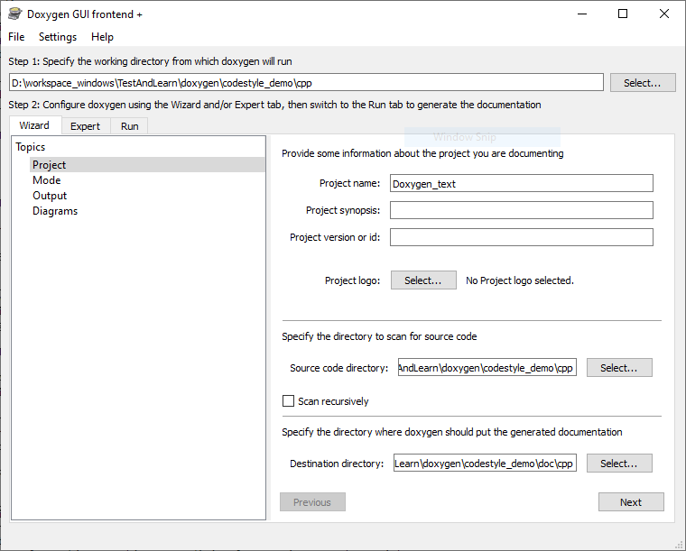

A demo project for c++/python/c code style, documentation, e.t.c.

The project test with:
- Doxygen : 1.8.20
- Visual Studio 16.7.4
- Visual Code 1.49.1
- Python 3.8

# Documentation

The Python documentation is generate with [Sphinx](https://www.sphinx-doc.org/en/master/).
The c/c++ documentation are generated with [Doxygen](https://www.doxygen.nl/manual/starting.html).

## c/c++

Setup Doxygen Runtime & Configuration:
1. Download from [Doxygen official Website](https://www.doxygen.nl/download.html#srcbin);
1. Run `Doxywizard` to setup and create a configuration file. The GUI shown as Fig.1;
1. Copy and Save the output configuration to a file. e.g. the file `cpp/doxygen.cfg`.

<figure class="image">
  
  <figcaption>Fig.1 Doxywizard</figcaption>
</figure>

Setup Visual Studio:

Download and instal the following plugins:
- [1-Click Docs](https://marketplace.visualstudio.com/items?itemName=StaughtonCoding.OneClickDocs&ssr=false#overview): Easily run Doxygen
- [Doxygen Comments](https://marketplace.visualstudio.com/items?itemName=FinnGegenmantel.doxygenComments#Customizing) : Automatic doxygen comments creation

### 1-Click Docs

The Plugin is just a Front end (UI), it still just to set the path of Doxygen.exe and configure file.
The configuration as fellowing images:

<figure class="image">
  
  <figcaption>Fig.2 1-Click Docs</figcaption>
</figure>

Then, run Doxygen.exe in the Visual Studio with button `TOOLS`->`1-Click Docs`->`Run Doxygen`.

### Doxygen Comments

TIP: From the Visual Studio 2019 16.8 Preview 3, it provide the [c++ auto comment function](https://docs.microsoft.com/en-us/visualstudio/releases/2019/release-notes-preview#c)

<figure class="image">
  
  <figcaption>Fig.4 1-Click Docs</figcaption>
</figure>

The custom configuration of Doxygen comment can set at `Tools` -> `Options` -> `Doxygen`.
In the function of header type '/**' + `Enter` to generate comment auto.

More please reference [official website](https://github.com/fingeg/DoxygenComments).

<figure class="image">
  
  <figcaption>Fig.3 1-Click Docs</figcaption>
</figure>

## Python

# Cody Style 

c/cpp reference: https://google.github.io/styleguide/cppguide.html#Inputs_and_Outputs

Python https://google.github.io/styleguide/pyguide.html

And others' programming language guide: https://google.github.io/styleguide/

